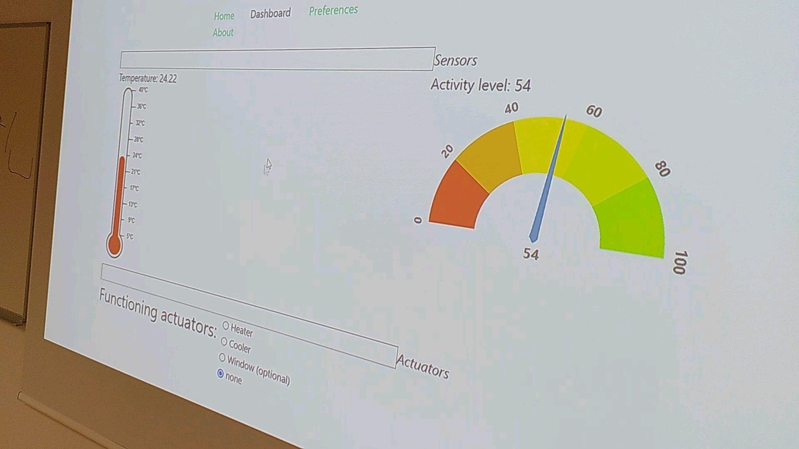
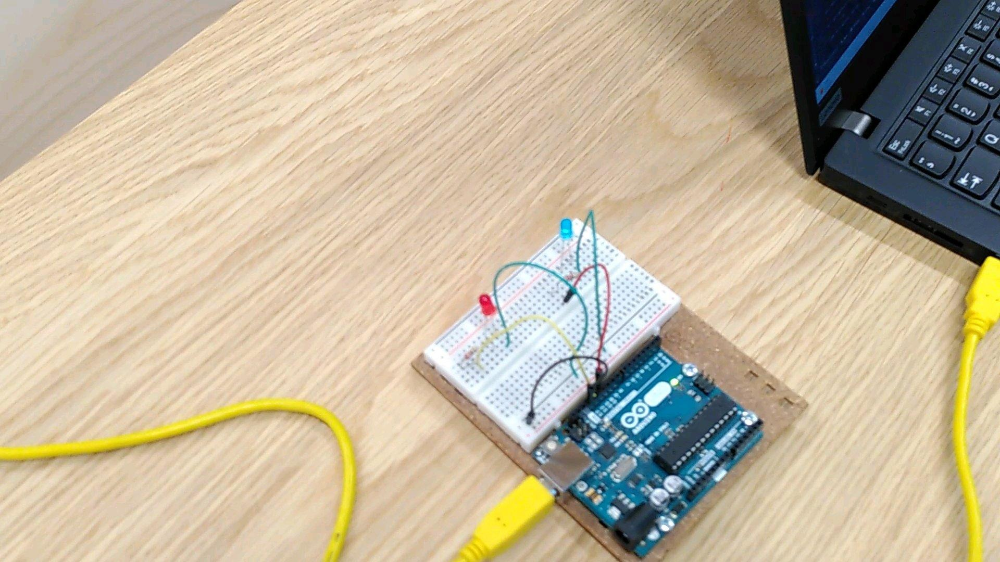
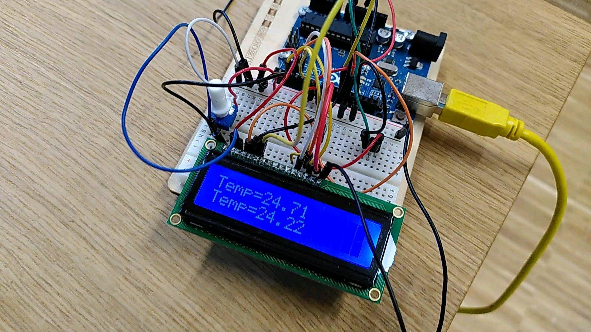
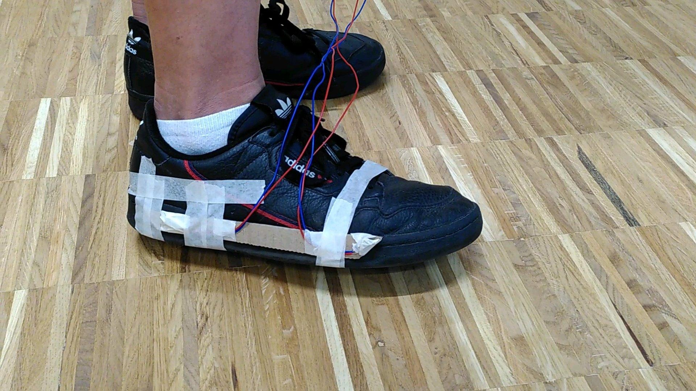
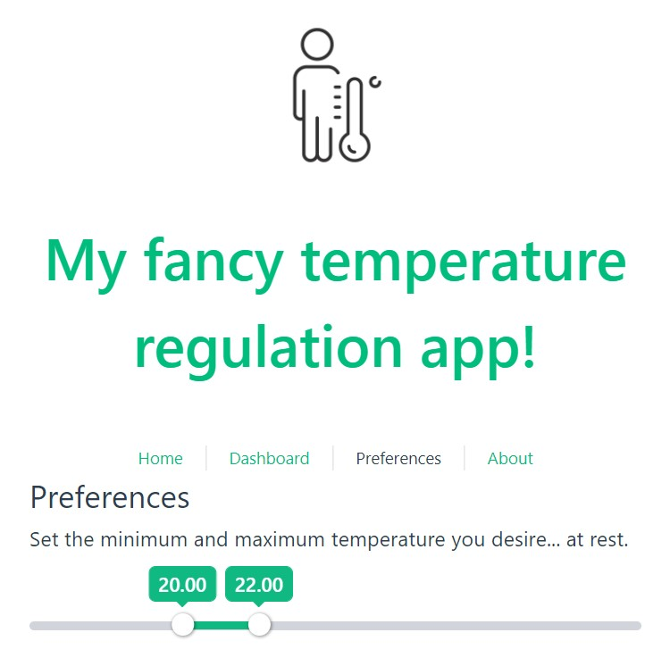

# Activity-based temperature regulation WoT application

## Context

This project was realized at InnoRenew CoE / Primorska University, in Koper, Slovenia, in August 2022.
It was funded by an Erasmus+ exchange between Université Claude Bernard Lyon 1, France, and University of Primorska.
The aim was to give lectures ([part 1](https://perso.liris.cnrs.fr/lionel.medini/enseignement/Koper-2022/1-IoT-and-IA-2022.pdf), [part 2](https://perso.liris.cnrs.fr/lionel.medini/enseignement/Koper-2022/2-Hardware.pdf) & [part 3](https://perso.liris.cnrs.fr/lionel.medini/enseignement/Koper-2022/3-Software.pdf)) and organize practical sessions about Internet of Things (IoT), Web of Things (WoT), and a bit of Web programming.

## Scenario

The general idea is to start from a regular temperature regulation scenario where the user sets their minimum and maximum accepted temperature.
The room temperature is sensed by a sensor and we assume that we dispose of a heater and an air conditioner to change the room temperature. In this scenario, they are symbolized by a red and a blue LED.
When the temperature drops below the minimum threshold, the applicaiton starts the heater, and it starts cooling when it is above the maximum one.

Then the user starts to do sports and wants the regulation to be adapted to lower values according to their activity level.
The motion sensor detects the user's activity, and the application lowers the two thresholds according to the measured activity level (i.e. the number of steps by minute).

## Setup

### Hardware

We used some physical hardware lent by Université Claude Bernard Lyon 1:

- 3 arduino Uno microcontrollers
- 1 temperature sensor
- 1 motion sensor
- 2 LEDs (red and blue)
- 1 LCD screen

### Software

- **Web server**: written in Python / FLask. It exposes an Web API that handles the sensors and actuator values. It is also connected to an arduino board that controls the actuators (heater and cooler) using [Pymata](https://pypi.org/project/PyMata/) (Python Firmata client) and controls them according to the HTTP requests it received.
 
- **Sensor clients**:
  - **Temperature client**: written in JavaScript / Node, and reading data on the Serial port. These data are sent by another arduino that queries a temperature sensor (and displays the value on a LCD screen BTW), and sends these data over the USB cable every second. The client listens to these events and sends an HTTP request to the server to update the current temperature.
   
  - **Step counter client**: written in Python, and reading data on the Serial port. These data are sent by a third arduino that queries a motion sensor and sends these data over the USB cable every 500ms. The client then sends a value between 0 and 120 steps by minute to the server every 5 seconds.
   
- **GUI client**: written in JS / Vue3; this is the Single-Page Application used by the user to:
  - set their preferences as 2 temeperatre thresholds
  - monitor the system sensor and actuator states on the dashboard
   

Note that this application follows (some of) the REST principles:

- the server is responsible to manage the physical devices (sensors and actuators) and exposes them as resources,
- the client manages the application flow by querying and acting on these resources, as well as handling the user's data and application logic.

## Installation:

By cloning the repo and deploying the software parts on the machines connected to the different arduinos using the regular install procedure for each language, you will have done most of the job:

1. [REST server + actuators control](https://github.com/lmedini/Koper-IoT-2022/tree/main/IoTServer_REST): execute as Python script
2. [arduino code for the temperature sensor](https://github.com/lmedini/Koper-IoT-2022/blob/main/Temp_Screen/Temp_Screen.ino): deploy using IDE
3. [client code for the temperature sensor](https://github.com/lmedini/Koper-IoT-2022/tree/main/tempReader-client): npm install; node index.js
4. [arduino code for the motion sensors](https://github.com/lmedini/Koper-IoT-2022/blob/main/activity-step-counter/tilt_reader.ino): deploy using IDE
5. [client code for motion sensors](https://github.com/lmedini/Koper-IoT-2022/tree/main/activity-step-counter) (only Python files): execute as Python script
6. [GUI client](https://github.com/lmedini/Koper-IoT-2022/tree/main/iot-web-client): npm install; npm run build; copy *dist* dir on static server

Just eventually remember that:

- for the demo, to avoid cross-origin problems with the GUI client, we built it and deployed it on an [nginx server](https://nginx.org/) so that the server serves the GUI as static content and is configured as a reverse proxy to the python server (with base URL */iot-api/*) for the GUI. See the [docs](https://docs.nginx.com/nginx/admin-guide/web-server/reverse-proxy/) here. Hence, it can send requests to the sensors and actuators, through the same origin.
- Arduino clients are plugged in USB to a serial port of the machine. This port can change each time you plug it. You should then update the port name, for instance by starting an Arduino IDE and see on which port it detects the Arduino.
- Of course, the URL of the Python server can change. It must be configured in the sensor clients, as well as in the reverse proxy (nginx) configuration.
- In the GUI, the frequency of the updates / queries is defined in the Vue components (Avtivity, Actuators and Temperature). If you want to modify this, you should modify the parameter of the *setInterval(..., 5000)* function in the *created()* bloc.

## Usage

I could have added the video, but I'm not much of a film maker... ;)
